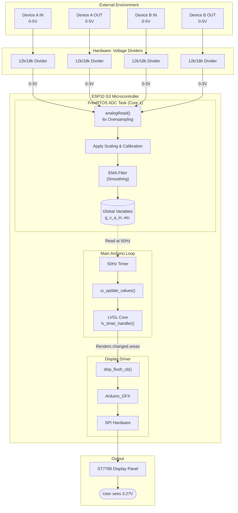

# 🔄 System Flowchart: ESP32-S3 DC Voltmeter

This document outlines the hardware and software architecture of the DC Voltmeter system, showing how the physical voltage signals are processed all the way through to the pixels on the screen.

## Complete Architecture Flow

## Software Components Explained

### 1. FreeRTOS ADC Task (`adc_task.cpp`)
- **Role:** Runs independently in the background on Core 1.
- **Process:**
  - Reads the raw ADC values using `analogRead()`. It takes 6 readings rapidly and averages them (Oversampling) to reduce immediate noise.
  - Multiplies the raw reading by the `DIVIDER_SCALE` (1.667) to convert the 0-3V reading back to a 0-5V representation.
  - Applies individual channel calibration multipliers (e.g., `CAL_A_IN`).
  - Passes the result through an **Exponential Moving Average (EMA)** filter to smoothly transition values and ignore small electrical spikes.
  - Stores the final, clean voltage in global volatile variables (`g_v_a_in`, etc.).

### 2. Main Arduino Loop (`esp32s3_dc_voltmeter.ino`)
- **Role:** Handles the UI updates at a fixed frame rate.
- **Process:**
  - Uses a non-blocking `millis()` timer to execute exactly 50 times a second (50Hz).
  - Calls `ui_update_values()` passing in the latest values from the global variables.
  - Calls `lv_timer_handler()` which tells LVGL to process any UI changes.

### 3. LVGL UI Engine (`ui.cpp`)
- **Role:** Manages the graphical elements on the screen.
- **Process:**
  - Compares the new voltage values with the previously displayed values.
  - If a value has changed, it invalidates (marks for redraw) ONLY the specific bar graph and text label that changed.
  - Calculates the new width of the bar graph and the new text string.
  - Renders these updated pixels into a small memory buffer (partial buffering).

### 4. Display Driver (`display_setup.cpp`)
- **Role:** Pushes pixels to the physical screen.
- **Process:**
  - When LVGL finishes rendering a buffer, it triggers `disp_flush_cb()`.
  - This callback uses the `Arduino_GFX` library to push that specific rectangle of pixels over the hardware SPI bus to the ST7789 display controller.
